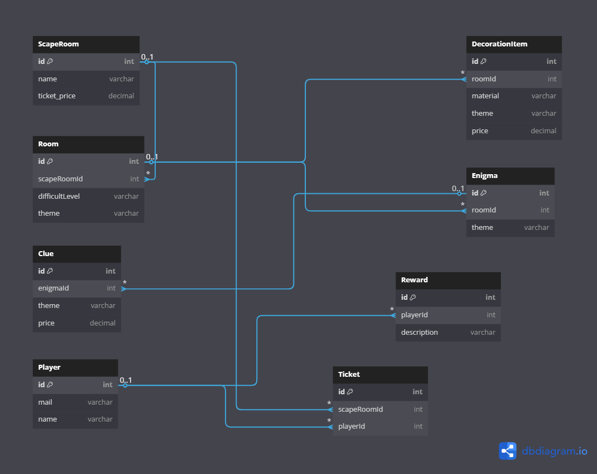

# 🧩 Virtual Escape Room Manager

Welcome to the **Virtual Escape Room Manager**, a collaborative Java-based simulation for designing, managing, and interacting with thrilling virtual escape rooms.

## 🚀 Project Description

This console application allows users to build and manage immersive Escape Rooms by adding themed rooms, puzzles, decorations, and items. The platform also handles business logic like ticket sales, player rewards, revenue tracking, and event notifications using a modular architecture and classic design patterns.

## 🎯 Key Features

- ✅ Create a new Escape Room with a unique name
- 🏰 Add themed rooms with difficulty levels
- 🕵️ Insert enigmas and clues related to room themes
- 🎨 Add decorative items (wood, metal, plastic, etc.)
- 📦 Track inventory of rooms, clues, decorations
- 💶 Calculate and display total inventory value (€)
- 🗑️ Delete items from the inventory
- 📜 Generate achievement certificates for players
- 🎁 Reward players with gifts
- 🧾 Issue sales tickets to players
- 📈 Calculate and display total revenue
- 🔔 Notify users of changes in rooms, clues, enigmas, and decorations
- 📝 Allow users to subscribe to modification notifications

## 🧠 Architecture & Design Patterns

The project follows a modular and scalable architecture with clear separation of concerns:

- **DAO Pattern**: Each entity has a dedicated DAO for database operations (using MySQL)
- **Singleton Pattern**: Ensures a single instance of the database connection (`DatabaseConnection.java`)
- **Observer Pattern**: Enables user notification when Escape Rooms, clues, enigmas, or decorations are modified
- **Manager Layer**: Handles business logic and coordination between components
- **Menu Layer**: Provides interactive console-based navigation
- **Environment Configuration**: Uses `.env` file for secure database access credentials

### ✔️ DAO Implementations

Each entity has a `DAO` interface and a concrete `*DAOSQL.java` class:

- `Player`, `Ticket`, `Reward`
- `ScapeRoom`, `Room`, `Item`
- `Clue`, `Enigma`, `DecorationItem`

All SQL interactions use `PreparedStatement` and JDBC best practices.


## Uml




# 🗃️ SQL Data Model

The MySQL schema includes:

- `ScapeRoom` → `Room` → `Item` → (`Enigma`, `DecorationItem`, `Clue`)
- `Reward` and `Ticket` are linked to `Player` via email
- Foreign key constraints and auto-incremented IDs ensure integrity

> See [`scaperoom.sql`](./scaperoom.sql) for the complete SQL schema

## 🛠️ Tech Stack

- **Java 17** – Application logic
- **MySQL** – Data persistence
- **JUnit** – Unit testing
- **Git** – Version control (GitFlow)
- **Trello** – Agile project management
- **IntelliJ IDEA** – Primary IDE

## 🧪 Getting Started

1. Clone the repository:
   ```bash
   git clone https://github.com/AdriaVH/3.3-DevTeam-EscapeRoom.git
   ```

2. Set environment variables in a `.env` file:
   ```
   DB_URL=jdbc:mysql://your-db-url:port/dbname
   DB_USER=your-username
   DB_PASSWORD=your-password
   ```

3. Open the project in IntelliJ IDEA and run `Main.java`.

4. Navigate the application via the terminal menu.

## 🔄 Team Workflow

👥 Team of 4 developers using Agile and GitFlow methodology.

- 📅 Daily 5-minute stand-ups:
    - What did you do yesterday?
    - What will you do today?
    - Any blockers?

- ✅ Milestones:
    - Initial checkpoint (UML + SQL schema)
    - Follow-up checkpoints every 2–3 days

## 👨‍💻 Contributors

- Adrià Vargas
- Alex Redondo
- Ignasi Subirachs
- Toni Romero

---

🎉 Thank you for checking out our project! We hope you enjoy exploring the Escape Room Manager as much as we enjoyed building it.
